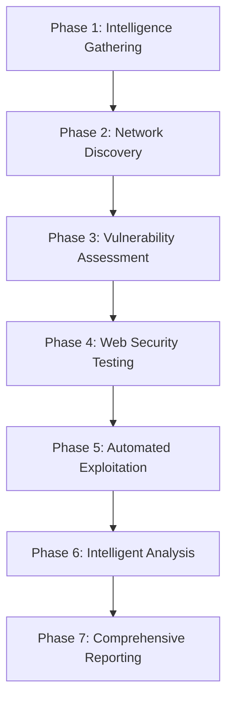

# Azaz-El v7.0.0-ULTIMATE - Advanced Automated Pentesting Framework

```
██████╗ ███████╗██████╗ ███████╗     ███████╗██╗     
██╔══██╗██╔════╝██╔══██╗██╔════╝     ██╔════╝██║     
██████╔╝█████╗  ██████╔╝█████╗       █████╗  ██║     
██╔══██╗██╔══╝  ██╔══██╗██╔══╝       ██╔══╝  ██║     
██║  ██║███████╗██████╔╝███████╗     ███████╗███████╗
╚═╝  ╚═╝╚══════╝╚═════╝ ╚══════╝     ╚══════╝╚══════╝
```

🚀 **The Most Advanced Automated Pentesting Framework** 🚀

## 🔥 Azaz-El v7.0.0-ULTIMATE - Next Generation Security Assessment

**The ultimate professional penetration testing framework with AI-powered automation, advanced exploitation capabilities, and comprehensive security assessment features.**

### ✨ Revolutionary Features
- **🤖 AI-Powered Analysis**: Intelligent vulnerability assessment and exploitation
- **🔄 7-Phase Automated Pipeline**: Complete end-to-end security testing
- **⚡ High-Performance Scanning**: Concurrent multi-target assessment
- **🛡️ Advanced Exploitation Engine**: Safe, controlled exploitation verification
- **📊 Intelligent Reporting**: Multi-format reports with executive summaries
- **🔧 30+ Integrated Tools**: Comprehensive security tool ecosystem

## 🚀 Quick Start

### One-Line Installation
```bash
curl -fsSL https://raw.githubusercontent.com/cxb3rf1lth/Azaz-El/main/install.sh | bash
```

### Manual Installation
```bash
# Clone the repository
git clone https://github.com/cxb3rf1lth/Azaz-El.git
cd Azaz-El

# Run the v7 installer
chmod +x install.sh
./install.sh
```

### Basic Usage
```bash
# Quick scan
python3 azaz_el_ultimate.py --target example.com --quick

# Full comprehensive scan
python3 azaz_el_ultimate.py --target example.com --full

# Advanced scan with custom config
python3 azaz_el_ultimate.py --target example.com --config custom_config.json --output /results/

# Multi-target scanning
python3 azaz_el_ultimate.py --targets-file targets.txt --concurrent 10
```

## 🔧 Architecture Overview

### 7-Phase Scan Pipeline



#### Phase 1: Intelligence Gathering
- **OSINT Collection**: Passive information gathering
- **Domain Enumeration**: Comprehensive subdomain discovery
- **Asset Discovery**: Infrastructure mapping
- **Threat Intelligence**: Known vulnerabilities lookup

#### Phase 2: Network Discovery  
- **Port Scanning**: Advanced service detection
- **Service Fingerprinting**: Detailed service analysis
- **SSL/TLS Analysis**: Certificate and configuration review
- **Network Topology**: Infrastructure mapping

#### Phase 3: Vulnerability Assessment
- **CVE Mapping**: Known vulnerability identification
- **Configuration Analysis**: Security misconfigurations
- **Version Detection**: Outdated software identification
- **Compliance Checking**: Standards violation detection

#### Phase 4: Web Security Testing
- **XSS Detection**: Advanced cross-site scripting tests
- **SQL Injection**: Comprehensive injection testing
- **CSRF Testing**: Cross-site request forgery detection
- **Authentication Bypass**: Login mechanism testing

#### Phase 5: Automated Exploitation
- **Safe Exploitation**: Controlled proof-of-concept testing
- **Payload Generation**: Context-aware exploit creation
- **Privilege Escalation**: Post-exploitation testing
- **Evidence Collection**: Comprehensive proof gathering

#### Phase 6: Intelligent Analysis
- **ML-based Analysis**: Pattern recognition and filtering
- **Risk Prioritization**: Business impact assessment
- **False Positive Detection**: Automated FP elimination
- **Correlation Analysis**: Finding relationship mapping

#### Phase 7: Comprehensive Reporting
- **Multi-format Reports**: HTML, JSON, PDF output
- **Executive Summaries**: Business-focused reporting
- **Technical Details**: Complete technical documentation
- **Evidence Packages**: Screenshots, payloads, proof data

## 🛠️ Integrated Security Tools (30+)

### Core Intelligence Tools
- **subfinder**: Fast subdomain discovery
- **amass**: Comprehensive asset discovery
- **httpx**: Advanced HTTP probing
- **nuclei**: Template-based vulnerability scanning
- **naabu**: High-speed port scanning

### Web Application Testing
- **katana**: Modern web crawling
- **dalfox**: Advanced XSS scanner
- **sqlmap**: SQL injection testing
- **ffuf**: Fast web fuzzer
- **gobuster**: Directory enumeration

### Advanced Analysis
- **dnsx**: DNS resolver and enumeration
- **tlsx**: TLS configuration analysis
- **cdncheck**: CDN detection and analysis
- **asnmap**: ASN mapping and enumeration
- **notify**: Real-time alerting system

## 📋 Configuration

### Ultimate Configuration File
The framework uses a comprehensive JSON configuration file located at `config/azaz-el-ultimate.json`:

```json
{
    "version": "7.0.0-ULTIMATE",
    "framework": {
        "name": "Azaz-El Ultimate",
        "concurrent_scans": 50,
        "max_memory_usage": 0.8,
        "max_cpu_usage": 0.9,
        "default_timeout": 300
    },
    "scanning": {
        "enable_exploitation": false,
        "enable_bruteforce": false,
        "enable_fuzzing": true,
        "aggressive_mode": false
    },
    "api_keys": {
        "shodan": "your_shodan_api_key",
        "censys": "your_censys_api_key",
        "securitytrails": "your_securitytrails_api_key",
        "chaos": "your_chaos_api_key"
    }
}
```

## 📊 Reporting & Output

### Report Formats
- **HTML**: Interactive web-based reports
- **JSON**: Machine-readable structured data
- **PDF**: Executive and technical reports
- **CSV**: Spreadsheet-compatible exports

### Sample Report Structure
```
reports/
├── scan_20241218_123456/
│   ├── executive_summary.pdf
│   ├── technical_report.html
│   ├── findings.json
│   ├── evidence/
│   │   ├── screenshots/
│   │   ├── payloads/
│   │   └── proof_of_concept/
│   └── compliance/
│       ├── owasp_mapping.json
│       └── nist_compliance.pdf
```

## 🔥 Advanced Features

### AI-Powered Analysis
- **Vulnerability Correlation**: Intelligent finding relationships
- **False Positive Detection**: ML-based accuracy improvement
- **Risk Scoring**: Business impact assessment
- **Payload Optimization**: Context-aware exploit generation

### Distributed Scanning
- **Multi-node Architecture**: Scale across multiple systems
- **Load Balancing**: Automatic work distribution
- **Fault Tolerance**: Robust error handling
- **Resource Optimization**: Intelligent resource management

### Real-time Monitoring
- **Live Dashboards**: Real-time scan progress
- **Alerting System**: Instant notification system
- **Performance Metrics**: System performance monitoring
- **Threat Intelligence**: Live threat feed integration

## 🛡️ Security & Compliance

### Responsible Usage
- **Authorized Testing Only**: Only test systems you own or have permission to test
- **Rate Limiting**: Respect target system resources
- **Safe Exploitation**: Non-destructive testing methods
- **Privacy Protection**: Secure handling of sensitive data

### Compliance Frameworks
- **OWASP Top 10**: Complete coverage and mapping
- **NIST Cybersecurity Framework**: Compliance reporting
- **PCI-DSS**: Payment card industry standards
- **ISO 27001**: Information security management

## 🚀 Performance & Scalability

### High-Performance Features
- **Async Operations**: Non-blocking I/O operations
- **Connection Pooling**: Efficient resource utilization
- **Memory Management**: Optimized memory usage
- **CPU Optimization**: Multi-core processing support

### Scalability Options
- **Concurrent Scanning**: Up to 50 simultaneous scans
- **Distributed Architecture**: Multi-node deployment
- **Cloud Integration**: AWS, Azure, GCP support
- **Container Ready**: Docker and Kubernetes support

## 🤝 Contributing

We welcome contributions to the Azaz-El v7 Ultimate framework! Please see our [Contributing Guidelines](CONTRIBUTING.md) for details.

### Development Setup
```bash
# Clone the repository
git clone https://github.com/cxb3rf1lth/Azaz-El.git
cd Azaz-El

# Create development environment
python3 -m venv venv
source venv/bin/activate
pip install -r requirements.txt

# Run tests
python3 test_ultimate_framework.py
```

## 📄 License

This project is licensed under the MIT License - see the [LICENSE](LICENSE) file for details.

## 🙏 Acknowledgments

- **ProjectDiscovery** - For excellent security tools
- **OWASP** - For security guidelines and frameworks
- **Security Community** - For continuous improvement and feedback

---

**⚠️ Disclaimer**: This tool is for authorized security testing only. Users are responsible for complying with all applicable laws and regulations. Always obtain proper authorization before testing any systems.

🔥 **Azaz-El v7.0.0-ULTIMATE - Redefining the Future of Automated Penetration Testing** 🔥