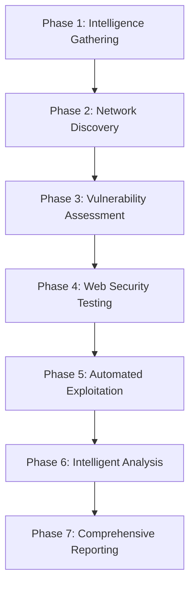

# Azaz-El v7.0.0-ULTIMATE - Advanced Automated Pentesting Framework

```
   _____                               .__   
  /  _  \ _____________  ________ ____ |  |  
 /  /_\  \\___   /\__  \ \___   // __ \|  |  
/    |    \/    /  / __ \_/    /\  ___/|  |__
\____|__  /_____ \(____  /_____ \\___  >____/
        \/      \/     \/      \/    \/      
```

🚀 **The Most Advanced Automated Pentesting Framework** 🚀

## 🔥 Azaz-El v7.0.0-ULTIMATE - Next Generation Security Assessment

**The ultimate professional penetration testing framework with AI-powered automation, advanced exploitation capabilities, and comprehensive security assessment features.**

### ✨ Revolutionary Features
- **🤖 AI-Powered Analysis**: Intelligent vulnerability assessment and exploitation
- **🔄 7-Phase Automated Pipeline**: Complete end-to-end security testing
- **⚡ High-Performance Scanning**: Concurrent multi-target assessment
- **🛡️ Advanced Exploitation Engine**: Safe, controlled exploitation verification
- **📊 Intelligent Reporting**: Multi-format reports with executive summaries
- **🔧 30+ Integrated Tools**: Comprehensive security tool ecosystem

## 🚀 Quick Start

### One-Line Installation
```bash
curl -fsSL https://raw.githubusercontent.com/cxb3rf1lth/Azaz-El/main/install.sh | bash
```

### Manual Installation
```bash
# Clone the repository
git clone https://github.com/cxb3rf1lth/Azaz-El.git
cd Azaz-El

# Run the v7 installer
chmod +x install.sh
./install.sh
```

### Basic Usage
```bash
# Quick scan
python3 azaz_el_ultimate.py --target example.com --quick

# Full comprehensive scan
python3 azaz_el_ultimate.py --target example.com --full

# Advanced scan with custom config
python3 azaz_el_ultimate.py --target example.com --config custom_config.json --output /results/

# Multi-target scanning
python3 azaz_el_ultimate.py --targets-file targets.txt --concurrent 10
```

#### Alternative: Z3MUTH Framework
For advanced users, Z3MUTH provides enhanced capabilities:
```bash
# Z3MUTH interactive dashboard
python3 z3muth.py --dashboard

# Z3MUTH ultimate scan with rich output
python3 z3muth.py --target example.com --ultimate-scan --verbose
```

> 💡 **Note**: See the [Z3MUTH section](#-z3muth---advanced-security-testing-hub) below for complete documentation on this advanced framework.

## 🌟 Z3MUTH - Advanced Security Testing Hub

### Introduction to Z3MUTH

**Z3MUTH (Zenith of Advanced Multi-threaded Universal Testing Hub)** is the ultimate remastered pentesting framework included with Azaz-El. It provides a unified command-line interface with rich features, professional dashboard, and advanced parallel processing capabilities.

### ⚡ Z3MUTH Installation

Z3MUTH is included with the main Azaz-El installation and requires the same dependencies:

```bash
# Install Z3MUTH with Azaz-El
curl -fsSL https://raw.githubusercontent.com/cxb3rf1lth/Azaz-El/main/install.sh | bash

# Or manual installation
git clone https://github.com/cxb3rf1lth/Azaz-El.git
cd Azaz-El
chmod +x install.sh
./install.sh

# Verify Z3MUTH installation
python3 z3muth.py --version
```

### 🚀 Z3MUTH Quick Start

#### Interactive Dashboard Mode
```bash
# Launch interactive dashboard for real-time monitoring
python3 z3muth.py --dashboard
```

#### Basic Scanning Commands
```bash
# Quick vulnerability scan
python3 z3muth.py --target example.com --quick-scan

# Ultimate comprehensive scan
python3 z3muth.py --target example.com --ultimate-scan

# Web application focused scan
python3 z3muth.py --target example.com --web-scan

# API security scan
python3 z3muth.py --target api.example.com --api-scan

# Infrastructure scan
python3 z3muth.py --target example.com --infrastructure-scan
```

#### Multi-Target Scanning
```bash
# Multiple targets
python3 z3muth.py --targets example.com,test.com,demo.com --ultimate-scan

# File-based target list
python3 z3muth.py --targets-file targets.txt --ultimate-scan

# Aggressive scanning with exploitation
python3 z3muth.py --targets-file targets.txt --ultimate-scan --aggressive --enable-exploitation
```

### 🎛️ Z3MUTH Advanced Configuration

#### Scan Modes and Options
```bash
# Deep scanning with custom threads
python3 z3muth.py --target example.com --ultimate-scan --deep-scan --threads 20

# Rate-limited scanning
python3 z3muth.py --target example.com --quick-scan --rate-limit 10

# Custom timeout and output directory
python3 z3muth.py --target example.com --ultimate-scan --timeout 600 --output-dir /custom/reports/

# Verbose output for debugging
python3 z3muth.py --target example.com --ultimate-scan --verbose
```

#### Scan Management
```bash
# List active scans
python3 z3muth.py --list-scans

# Check scan status
python3 z3muth.py --scan-status SCAN_ID

# Cancel running scan
python3 z3muth.py --cancel-scan SCAN_ID

# View scan history
python3 z3muth.py --scan-history
```

#### Report Generation
```bash
# Generate HTML report (default)
python3 z3muth.py --generate-report SCAN_ID

# Generate PDF report
python3 z3muth.py --generate-report SCAN_ID --report-format pdf

# Generate JSON report for integration
python3 z3muth.py --generate-report SCAN_ID --report-format json

# Generate CSV for spreadsheet analysis
python3 z3muth.py --generate-report SCAN_ID --report-format csv
```

### ⚙️ Z3MUTH Configuration

Z3MUTH uses the configuration file `z3muth_config.json` for advanced settings:

```json
{
  "version": "1.0.0-ZENITH",
  "core": {
    "max_concurrent_scans": 50,
    "default_timeout": 300,
    "max_memory_usage": 0.8,
    "max_cpu_usage": 0.9
  },
  "tools": {
    "nuclei": {
      "enabled": true,
      "flags": ["-silent", "-severity", "low,medium,high,critical"]
    },
    "subfinder": {
      "enabled": true,
      "flags": ["-all", "-recursive"]
    }
  },
  "output": {
    "output_dir": "z3muth_reports",
    "report_formats": ["html", "json"],
    "include_screenshots": true
  }
}
```

### 🎯 Z3MUTH Key Features

- **🖥️ Interactive Dashboard**: Real-time scan monitoring and management
- **⚡ High Performance**: Multi-threaded scanning with resource optimization
- **🔧 Modular Architecture**: Extensible scanner and tool integration
- **📊 Advanced Reporting**: Multiple output formats with rich visualizations
- **🛡️ Safe Exploitation**: Controlled proof-of-concept testing
- **🔄 Scan Management**: Full lifecycle management of security assessments
- **🎨 Rich CLI Interface**: Beautiful terminal output with progress indicators
- **⚙️ Flexible Configuration**: Comprehensive settings for all scan aspects

### 📝 Z3MUTH Command Reference

| Command | Description | Example |
|---------|-------------|---------|
| `--dashboard` | Launch interactive dashboard | `python3 z3muth.py --dashboard` |
| `--ultimate-scan` | Comprehensive security scan | `python3 z3muth.py --target example.com --ultimate-scan` |
| `--quick-scan` | Fast vulnerability assessment | `python3 z3muth.py --target example.com --quick-scan` |
| `--web-scan` | Web application focused scan | `python3 z3muth.py --target webapp.com --web-scan` |
| `--api-scan` | API security assessment | `python3 z3muth.py --target api.example.com --api-scan` |
| `--aggressive` | Enable aggressive scanning | `python3 z3muth.py --target example.com --ultimate-scan --aggressive` |
| `--enable-exploitation` | Enable safe exploitation | `python3 z3muth.py --target example.com --ultimate-scan --enable-exploitation` |
| `--list-scans` | Show active scans | `python3 z3muth.py --list-scans` |
| `--generate-report` | Create scan report | `python3 z3muth.py --generate-report SCAN_ID --report-format pdf` |

### 💡 Z3MUTH Pro Tips

#### 🎯 Effective Scanning Strategies
```bash
# Start with reconnaissance
python3 z3muth.py --target example.com --quick-scan

# Progressive scanning approach
python3 z3muth.py --target example.com --web-scan --verbose
python3 z3muth.py --target example.com --ultimate-scan --deep-scan

# Large-scale assessment
python3 z3muth.py --targets-file enterprise_assets.txt --ultimate-scan --threads 30 --rate-limit 20
```

#### 📊 Report Integration
```bash
# Generate multiple report formats for different stakeholders
python3 z3muth.py --generate-report SCAN_ID --report-format html --output-dir /reports/executives/
python3 z3muth.py --generate-report SCAN_ID --report-format json --output-dir /reports/technical/
python3 z3muth.py --generate-report SCAN_ID --report-format csv --output-dir /reports/analytics/
```

#### 🔄 Continuous Monitoring Workflow
```bash
# Set up monitoring dashboard
python3 z3muth.py --dashboard &

# Schedule regular scans
while true; do
    python3 z3muth.py --targets-file production_assets.txt --quick-scan --output-dir /monitoring/$(date +%Y%m%d)/
    sleep 86400  # Daily scans
done
```

### 🔗 Z3MUTH Integration with Azaz-El

Z3MUTH seamlessly integrates with the main Azaz-El framework, providing:

- **Shared Configuration**: Uses the same `config/` directory and API keys
- **Common Database**: Shares scan history and findings with Azaz-El Ultimate
- **Tool Ecosystem**: Leverages all installed security tools from Azaz-El
- **Report Compatibility**: Reports can be cross-referenced between frameworks
- **Resource Optimization**: Intelligent resource sharing and management

```bash
# Use both frameworks together
python3 azaz_el_ultimate.py --target domain1.com --full &
python3 z3muth.py --target domain2.com --ultimate-scan &

# Compare results
python3 z3muth.py --scan-history
```

## 🔧 Architecture Overview

### 7-Phase Scan Pipeline



#### Phase 1: Intelligence Gathering
- **OSINT Collection**: Passive information gathering
- **Domain Enumeration**: Comprehensive subdomain discovery
- **Asset Discovery**: Infrastructure mapping
- **Threat Intelligence**: Known vulnerabilities lookup

#### Phase 2: Network Discovery  
- **Port Scanning**: Advanced service detection
- **Service Fingerprinting**: Detailed service analysis
- **SSL/TLS Analysis**: Certificate and configuration review
- **Network Topology**: Infrastructure mapping

#### Phase 3: Vulnerability Assessment
- **CVE Mapping**: Known vulnerability identification
- **Configuration Analysis**: Security misconfigurations
- **Version Detection**: Outdated software identification
- **Compliance Checking**: Standards violation detection

#### Phase 4: Web Security Testing
- **XSS Detection**: Advanced cross-site scripting tests
- **SQL Injection**: Comprehensive injection testing
- **CSRF Testing**: Cross-site request forgery detection
- **Authentication Bypass**: Login mechanism testing

#### Phase 5: Automated Exploitation
- **Safe Exploitation**: Controlled proof-of-concept testing
- **Payload Generation**: Context-aware exploit creation
- **Privilege Escalation**: Post-exploitation testing
- **Evidence Collection**: Comprehensive proof gathering

#### Phase 6: Intelligent Analysis
- **ML-based Analysis**: Pattern recognition and filtering
- **Risk Prioritization**: Business impact assessment
- **False Positive Detection**: Automated FP elimination
- **Correlation Analysis**: Finding relationship mapping

#### Phase 7: Comprehensive Reporting
- **Multi-format Reports**: HTML, JSON, PDF output
- **Executive Summaries**: Business-focused reporting
- **Technical Details**: Complete technical documentation
- **Evidence Packages**: Screenshots, payloads, proof data

## 🛠️ Integrated Security Tools (30+)

### Core Intelligence Tools
- **subfinder**: Fast subdomain discovery
- **amass**: Comprehensive asset discovery
- **httpx**: Advanced HTTP probing
- **nuclei**: Template-based vulnerability scanning
- **naabu**: High-speed port scanning

### Web Application Testing
- **katana**: Modern web crawling
- **dalfox**: Advanced XSS scanner
- **sqlmap**: SQL injection testing
- **ffuf**: Fast web fuzzer
- **gobuster**: Directory enumeration

### Advanced Analysis
- **dnsx**: DNS resolver and enumeration
- **tlsx**: TLS configuration analysis
- **cdncheck**: CDN detection and analysis
- **asnmap**: ASN mapping and enumeration
- **notify**: Real-time alerting system

## 📋 Configuration

### Ultimate Configuration File
The framework uses a comprehensive JSON configuration file located at `config/azaz-el-ultimate.json`:

```json
{
    "version": "7.0.0-ULTIMATE",
    "framework": {
        "name": "Azaz-El Ultimate",
        "concurrent_scans": 50,
        "max_memory_usage": 0.8,
        "max_cpu_usage": 0.9,
        "default_timeout": 300
    },
    "scanning": {
        "enable_exploitation": false,
        "enable_bruteforce": false,
        "enable_fuzzing": true,
        "aggressive_mode": false
    },
    "api_keys": {
        "shodan": "your_shodan_api_key",
        "censys": "your_censys_api_key",
        "securitytrails": "your_securitytrails_api_key",
        "chaos": "your_chaos_api_key"
    }
}
```

## 📊 Enhanced Reporting & Results Management

### 🎯 New Enhanced Features (v7.0.0-ULTIMATE)

- **🧠 Intelligent Filtering**: Advanced false positive detection and results filtering
- **💾 Enhanced Database**: Comprehensive database schema with automated exports 
- **📁 Multi-Format Export**: Automatic export to JSON, CSV, XML, and HTML formats
- **⭐ Finding Enhancement**: Automatic detection and prioritization of high-value findings
- **🔧 CLI Filtering Options**: Command-line control over filtering and export settings
- **📊 Executive Summaries**: Automated generation of executive-level reports

### Report Formats

- **HTML**: Interactive web-based reports with expandable findings
- **JSON**: Machine-readable structured data for integration
- **CSV**: Spreadsheet-compatible exports for analysis  
- **XML**: Structured format for enterprise integration

### Enhanced Database Schema

The enhanced database now stores comprehensive scan metadata including:
- Detailed finding categorization and risk scoring
- Compliance framework mapping (OWASP, NIST, ISO27001)
- False positive detection and filtering history
- Performance metrics and tool usage statistics
- Executive summary data and recommendations

### Intelligent Results Filtering

**Automated False Positive Detection:**
- Pattern-based detection of common false positives
- Context-aware filtering based on environment and target type
- Confidence scoring and adjustment algorithms
- Custom filter rules with configurable actions

**Filter Configuration Options:**
- `--min-confidence`: Set minimum confidence threshold (0.0-1.0)
- `--exclude-severities`: Exclude specific severity levels
- `--exclude-fps`: Automatically exclude false positives  
- `--no-filtering`: Disable all automated filtering
- `--export-formats`: Choose export formats (html, json, csv, xml)

### Sample Enhanced Report Structure
```
results/
├── scan_20241218_123456/
│   ├── scan_results.html          # Interactive web report
│   ├── scan_results.json          # Machine-readable data
│   ├── scan_results.csv           # Spreadsheet export
│   ├── scan_results.xml           # Enterprise integration
│   └── executive_summary.json     # Executive summary
```

## 🔥 Advanced Features

### AI-Powered Analysis
- **Vulnerability Correlation**: Intelligent finding relationships
- **False Positive Detection**: ML-based accuracy improvement
- **Risk Scoring**: Business impact assessment
- **Payload Optimization**: Context-aware exploit generation

### Distributed Scanning
- **Multi-node Architecture**: Scale across multiple systems
- **Load Balancing**: Automatic work distribution
- **Fault Tolerance**: Robust error handling
- **Resource Optimization**: Intelligent resource management

### Real-time Monitoring
- **Live Dashboards**: Real-time scan progress
- **Alerting System**: Instant notification system
- **Performance Metrics**: System performance monitoring
- **Threat Intelligence**: Live threat feed integration

## 🛡️ Security & Compliance

### Responsible Usage
- **Authorized Testing Only**: Only test systems you own or have permission to test
- **Rate Limiting**: Respect target system resources
- **Safe Exploitation**: Non-destructive testing methods
- **Privacy Protection**: Secure handling of sensitive data

### Compliance Frameworks
- **OWASP Top 10**: Complete coverage and mapping
- **NIST Cybersecurity Framework**: Compliance reporting
- **PCI-DSS**: Payment card industry standards
- **ISO 27001**: Information security management

## 🚀 Performance & Scalability

### High-Performance Features
- **Async Operations**: Non-blocking I/O operations
- **Connection Pooling**: Efficient resource utilization
- **Memory Management**: Optimized memory usage
- **CPU Optimization**: Multi-core processing support

### Scalability Options
- **Concurrent Scanning**: Up to 50 simultaneous scans
- **Distributed Architecture**: Multi-node deployment
- **Cloud Integration**: AWS, Azure, GCP support
- **Container Ready**: Docker and Kubernetes support

## 🤝 Contributing

We welcome contributions to the Azaz-El v7 Ultimate framework! Please see our [Contributing Guidelines](CONTRIBUTING.md) for details.

### Development Setup
```bash
# Clone the repository
git clone https://github.com/cxb3rf1lth/Azaz-El.git
cd Azaz-El

# Create development environment
python3 -m venv venv
source venv/bin/activate
pip install -r requirements.txt

# Run tests
python3 test_ultimate_framework.py
```

## 📄 License

This project is licensed under the MIT License - see the [LICENSE](LICENSE) file for details.

## 🙏 Acknowledgments

- **ProjectDiscovery** - For excellent security tools
- **OWASP** - For security guidelines and frameworks
- **Security Community** - For continuous improvement and feedback

---

**⚠️ Disclaimer**: This tool is for authorized security testing only. Users are responsible for complying with all applicable laws and regulations. Always obtain proper authorization before testing any systems.

🔥 **Azaz-El v7.0.0-ULTIMATE - Redefining the Future of Automated Penetration Testing** 🔥
