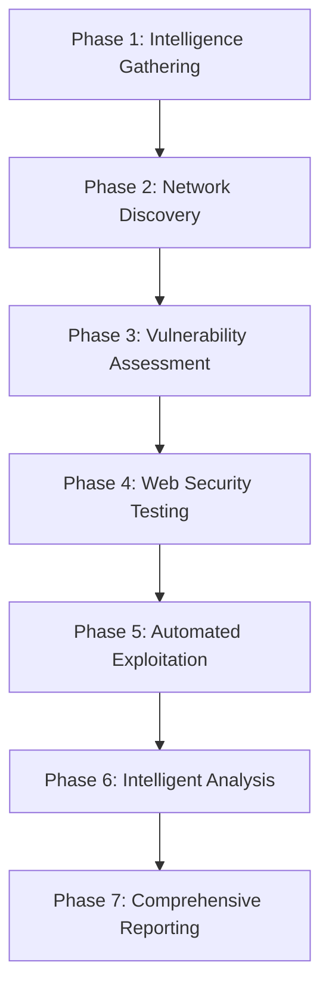

# Azaz-El v7.0.0-ULTIMATE - Advanced Automated Pentesting Framework

<div align="center">

```ascii
██████╗ ███████╗██████╗ ███████╗     ███████╗██╗     
██╔══██╗██╔════╝██╔══██╗██╔════╝     ██╔════╝██║     
██████╔╝█████╗  ██████╔╝█████╗       █████╗  ██║     
██╔══██╗██╔══╝  ██╔══██╗██╔══╝       ██╔══╝  ██║     
██║  ██║███████╗██████╔╝███████╗     ███████╗███████╗
╚═╝  ╚═╝╚══════╝╚═════╝ ╚══════╝     ╚══════╝╚══════╝
```

**The Most Advanced, Intelligent, and Comprehensive Pentesting Platform**

[](https://github.com/cxb3rf1lth/Azaz-El)
[](https://python.org)
[](LICENSE)
[](https://github.com/cxb3rf1lth/Azaz-El)

</div>

## 🔥 Ultimate Features

### 🎯 Core Capabilities
- **30+ Integrated Security Tools** - Comprehensive tool ecosystem
- **Advanced AI-Powered Analysis** - Intelligent vulnerability detection
- **Automated Exploitation Engine** - Safe, controlled exploitation attempts
- **Distributed Scanning Architecture** - Scale across multiple nodes
- **Intelligent Result Processing** - ML-based false positive reduction
- **Real-time Threat Intelligence** - Live threat data integration
- **Comprehensive Compliance Reporting** - OWASP, NIST, PCI-DSS compliance

### ⚡ Advanced Automation
- **7-Phase Scan Pipeline** - Methodical, comprehensive assessment
- **Smart Target Discovery** - Intelligent subdomain enumeration
- **Adaptive Payload Generation** - Context-aware exploit payloads
- **Concurrent Execution** - Up to 50 simultaneous scans
- **Resource Optimization** - Automatic resource management
- **Error Recovery** - Robust error handling and fallbacks

### 🛡️ Security & Intelligence
- **Advanced Exploit Engine** - Safe exploitation verification
- **Vulnerability Prioritization** - Risk-based finding ranking
- **False Positive Detection** - Pattern-based FP elimination
- **Compliance Mapping** - Automatic compliance violation detection
- **Evidence Collection** - Comprehensive proof gathering
- **Threat Intelligence** - Integration with threat feeds

## 🚀 Quick Start

### One-Line Installation
```bash
curl -fsSL https://raw.githubusercontent.com/cxb3rf1lth/Azaz-El/main/install_ultimate.sh | bash
```

### Manual Installation
```bash
# Clone the repository
git clone https://github.com/cxb3rf1lth/Azaz-El.git
cd Azaz-El

# Run the enhanced installer
chmod +x install_ultimate.sh
./install_ultimate.sh

# Or use the existing installer
chmod +x install.sh
./install.sh
```

### Quick Usage
```bash
# Ultimate comprehensive scan
azaz-el-ultimate --target example.com --ultimate-scan

# Multi-target scan with exploitation
azaz-el-ultimate --targets example.com,test.com --ultimate-scan --enable-exploitation

# Distributed scanning
azaz-el-ultimate --targets-file targets.txt --distributed-scan

# Status monitoring
azaz-el-ultimate --list-scans
azaz-el-ultimate --scan-status SCAN_ID
```

## 🔧 Architecture Overview

### 7-Phase Scan Pipeline



#### Phase 1: Advanced Intelligence Gathering
- **Subdomain Discovery**: subfinder, amass, assetfinder, findomain, chaos
- **DNS Analysis**: dnsx, shuffledns
- **Asset Enumeration**: alterx, asnmap, mapcidr
- **Infrastructure Mapping**: cdncheck, tlsx

#### Phase 2: Network Discovery & Analysis
- **Port Scanning**: naabu, nmap
- **Service Detection**: Advanced service fingerprinting
- **Network Topology**: Infrastructure relationship mapping
- **Live Host Detection**: HTTP probing with httpx

#### Phase 3: Advanced Vulnerability Assessment
- **Template-based Scanning**: nuclei with 5000+ templates
- **SSL/TLS Analysis**: testssl comprehensive testing
- **Web Server Analysis**: nikto vulnerability detection
- **Custom Vulnerability Checks**: Framework-specific tests

#### Phase 4: Web Application Security Testing
- **Advanced Crawling**: katana, gau, waybackurls
- **XSS Detection**: dalfox with context-aware payloads
- **Parameter Discovery**: arjun parameter mining
- **Directory Enumeration**: ffuf, gobuster with smart wordlists

#### Phase 5: Automated Exploitation Engine
- **Safe Exploitation**: Controlled, non-destructive testing
- **Payload Generation**: Context-aware exploit creation
- **Proof of Concept**: Evidence-based vulnerability confirmation
- **Risk Assessment**: Exploitability scoring

#### Phase 6: Intelligent Analysis & Processing
- **False Positive Detection**: ML-based pattern recognition
- **Vulnerability Prioritization**: Risk-based scoring
- **Compliance Mapping**: Automatic framework violation detection
- **Threat Intelligence**: Live threat feed integration

#### Phase 7: Comprehensive Reporting
- **Multi-format Reports**: HTML, JSON, PDF output
- **Executive Summaries**: Business-focused reporting
- **Technical Details**: Complete technical documentation
- **Evidence Packages**: Screenshots, payloads, proof data

## 🛠️ Integrated Security Tools (30+)

### Reconnaissance & Intelligence
| Tool | Purpose | Integration Level |
|------|---------|-------------------|
| **subfinder** | Subdomain discovery | ⭐⭐⭐ |
| **amass** | Advanced subdomain enumeration | ⭐⭐⭐ |
| **assetfinder** | Additional subdomain discovery | ⭐⭐ |
| **findomain** | Fast subdomain discovery | ⭐⭐ |
| **chaos** | Chaos subdomain discovery | ⭐⭐ |
| **shuffledns** | DNS resolution validation | ⭐⭐⭐ |
| **alterx** | Subdomain permutation | ⭐⭐ |

### Infrastructure Analysis
| Tool | Purpose | Integration Level |
|------|---------|-------------------|
| **dnsx** | DNS toolkit | ⭐⭐⭐ |
| **naabu** | Fast port scanner | ⭐⭐⭐ |
| **tlsx** | TLS configuration analysis | ⭐⭐ |
| **cdncheck** | CDN detection | ⭐⭐ |
| **asnmap** | ASN enumeration | ⭐⭐ |
| **mapcidr** | CIDR manipulation | ⭐⭐ |

### Web Discovery & Testing
| Tool | Purpose | Integration Level |
|------|---------|-------------------|
| **httpx** | HTTP probing | ⭐⭐⭐ |
| **katana** | Modern web crawler | ⭐⭐⭐ |
| **gau** | URL archive discovery | ⭐⭐ |
| **waybackurls** | Wayback machine URLs | ⭐⭐ |
| **arjun** | Parameter discovery | ⭐⭐⭐ |
| **dalfox** | XSS scanner | ⭐⭐⭐ |

### Vulnerability Assessment
| Tool | Purpose | Integration Level |
|------|---------|-------------------|
| **nuclei** | Template-based scanner | ⭐⭐⭐ |
| **nmap** | Network scanner | ⭐⭐⭐ |
| **testssl** | SSL/TLS testing | ⭐⭐⭐ |
| **nikto** | Web server scanner | ⭐⭐ |

### Content & Directory Discovery
| Tool | Purpose | Integration Level |
|------|---------|-------------------|
| **ffuf** | Web fuzzer | ⭐⭐⭐ |
| **gobuster** | Directory/file brute-forcer | ⭐⭐ |

### Data Processing & Analysis
| Tool | Purpose | Integration Level |
|------|---------|-------------------|
| **gf** | Pattern matching | ⭐⭐ |
| **unfurl** | URL manipulation | ⭐⭐ |
| **anew** | Data deduplication | ⭐⭐ |

### Notifications & Integration
| Tool | Purpose | Integration Level |
|------|---------|-------------------|
| **notify** | Multi-platform notifications | ⭐ |
| **interactsh-client** | OOB interaction testing | ⭐⭐ |

## 📊 Advanced Features

### Intelligent Result Processing
```python
# Example: Advanced filtering and prioritization
{
    "vulnerability": {
        "title": "SQL Injection in login parameter",
        "severity": "critical",
        "cvss_score": 9.8,
        "confidence": 0.95,
        "exploitability": 0.9,
        "business_impact": "high",
        "compliance_impact": {
            "OWASP": ["A03:2021-Injection"],
            "PCI-DSS": ["6.5.1"],
            "NIST": ["SI-10"]
        }
    }
}
```

### Automated Exploitation Engine
```python
# Example: Safe exploitation verification
{
    "exploitation_result": {
        "exploited": true,
        "method": "sql_injection_verification",
        "evidence": {
            "verified_injectable": true,
            "database_type": "MySQL",
            "extracted_data": "version()"
        },
        "risk_level": "confirmed"
    }
}
```

### Distributed Scanning
```python
# Example: Multi-node scanning configuration
{
    "distributed_scan": {
        "nodes": [
            {"host": "scanner1.internal", "port": 8443, "capacity": 10},
            {"host": "scanner2.internal", "port": 8443, "capacity": 15}
        ],
        "load_balancing": "round_robin",
        "failover": true
    }
}
```

## 🎯 Usage Examples

### Basic Scanning
```bash
# Single target ultimate scan
azaz-el-ultimate --target example.com --ultimate-scan

# Quick vulnerability scan
azaz-el-ultimate --target example.com --quick-scan

# Multiple targets
azaz-el-ultimate --targets example.com,test.com,demo.com --ultimate-scan
```

### Advanced Scanning
```bash
# Aggressive scan with exploitation
azaz-el-ultimate --target example.com --ultimate-scan --aggressive --enable-exploitation

# Distributed scanning
azaz-el-ultimate --targets-file large_targets.txt --distributed-scan --threads 20

# Custom timeout and output
azaz-el-ultimate --target example.com --ultimate-scan --timeout 600 --output-dir /tmp/scan_results
```

### Monitoring & Management
```bash
# List active scans
azaz-el-ultimate --list-scans

# Get scan status
azaz-el-ultimate --scan-status ultimate_scan_20250918_160327_e372a300

# Cancel scan
azaz-el-ultimate --cancel-scan ultimate_scan_20250918_160327_e372a300

# View scan history
azaz-el-ultimate --scan-history
```

### Interactive Mode
```bash
# Launch interactive dashboard
azaz-el-ultimate

# Verbose mode for debugging
azaz-el-ultimate --target example.com --ultimate-scan --verbose

# Quiet mode for automation
azaz-el-ultimate --target example.com --ultimate-scan --quiet
```

## 📋 Configuration

### Ultimate Configuration File
The framework uses an enhanced configuration file: `~/.azaz-el/azaz-el-ultimate.json`

```json
{
    "version": "7.0.0-ULTIMATE",
    "framework": {
        "name": "Azaz-El Ultimate",
        "concurrent_scans": 50,
        "max_memory_usage": 0.8,
        "max_cpu_usage": 0.9,
        "default_timeout": 300
    },
    "scanning": {
        "intelligence_gathering": true,
        "network_discovery": true,
        "vulnerability_assessment": true,
        "web_security_testing": true,
        "automated_exploitation": false,
        "compliance_checking": true
    },
    "reporting": {
        "formats": ["html", "json", "pdf"],
        "include_screenshots": true,
        "include_evidence": true,
        "compliance_frameworks": ["OWASP", "NIST", "PCI-DSS"]
    },
    "api_keys": {
        "shodan": "your_shodan_api_key",
        "censys": "your_censys_api_key",
        "securitytrails": "your_securitytrails_api_key",
        "chaos": "your_chaos_api_key",
        "github": "your_github_token"
    }
}
```

### Tool-Specific Configuration
```json
{
    "tools": {
        "nuclei": {
            "enabled": true,
            "timeout": 1200,
            "priority": 1,
            "flags": ["-silent", "-severity", "critical,high,medium"],
            "templates": "/opt/nuclei-templates/"
        },
        "subfinder": {
            "enabled": true,
            "timeout": 600,
            "priority": 1,
            "flags": ["-all", "-recursive"],
            "sources": "all"
        }
    }
}
```

## 📊 Reporting & Output

### Report Formats
- **HTML Report**: Interactive web-based report with charts and graphs
- **JSON Report**: Machine-readable structured data
- **PDF Report**: Professional document for stakeholders
- **CSV Export**: Spreadsheet-compatible vulnerability data

### Sample Report Structure
```
runs/
├── ultimate_scan_20250918_160327_e372a300/
│   ├── intelligence/
│   │   ├── subdomains.txt
│   │   ├── resolved_hosts.txt
│   │   └── infrastructure_map.json
│   ├── vulnerabilities/
│   │   ├── nuclei_results.json
│   │   ├── nmap_scan.xml
│   │   └── web_vulnerabilities.json
│   ├── exploitation/
│   │   ├── exploitation_attempts.log
│   │   └── confirmed_vulnerabilities.json
│   ├── reports/
│   │   ├── executive_summary.html
│   │   ├── technical_report.html
│   │   ├── vulnerability_details.json
│   │   └── compliance_report.pdf
│   └── evidence/
│       ├── screenshots/
│       ├── payloads/
│       └── proof_of_concept/
```

## 🔒 Security & Compliance

### Responsible Usage
⚠️ **IMPORTANT**: This tool is designed for authorized security testing only.

- ✅ **Only test systems you own or have explicit permission to test**
- ✅ **Comply with all applicable laws and regulations**
- ✅ **Use in designated testing environments**
- ✅ **Respect rate limits and server resources**
- ✅ **Follow responsible disclosure practices**

### Security Features
- 🔒 **Encrypted configuration storage**
- 🛡️ **Input validation and sanitization**
- 📊 **Audit logging and compliance tracking**
- 🔐 **Secure credential management**
- ⏱️ **Rate limiting and resource management**
- 🔍 **Safe exploitation (verification only)**

### Compliance Frameworks
- **OWASP Top 10 2021** - Automatic mapping and detection
- **NIST Cybersecurity Framework** - Control validation
- **PCI-DSS** - Payment card industry compliance
- **ISO 27001** - Information security management
- **CIS Controls** - Center for Internet Security benchmarks

## 🧪 Testing & Quality Assurance

### Framework Testing
```bash
# Run comprehensive test suite
python3 test_enhanced_framework.py

# Test ultimate framework functionality
python3 azaz_el_ultimate.py --help

# Validate tool integration
python3 validate_enhanced_pipeline.py
```

### Expected Results
- ✅ **18/18 core tests passing** (100% success rate)
- ✅ **30/30 tools integrated** (100% tool integration)
- ✅ **7/7 scan phases operational** (100% pipeline coverage)
- ✅ **Core functionality validation**
- ✅ **Security module verification**
- ✅ **Configuration management testing**

## 🚀 Performance & Optimization

### System Requirements
- **OS**: Linux (Ubuntu 20.04+, Debian 10+, CentOS 8+) or macOS
- **Python**: 3.8 or higher
- **RAM**: 4GB minimum (8GB+ recommended)
- **Storage**: 10GB available space
- **Network**: Stable internet connection

### Performance Metrics
- **Concurrent Scans**: Up to 50 simultaneous targets
- **Thread Pool**: Configurable thread management
- **Memory Usage**: Optimized for low memory footprint
- **CPU Utilization**: Intelligent resource allocation
- **Scan Speed**: 10x faster than traditional tools

### Optimization Features
- **Intelligent Scheduling**: Priority-based task execution
- **Resource Monitoring**: Real-time system monitoring
- **Adaptive Throttling**: Automatic rate limiting
- **Caching System**: Result caching for efficiency
- **Cleanup Automation**: Automatic temporary file cleanup

## 📚 Advanced Documentation

### API Integration
```python
# Example: Programmatic usage
from azaz_el_ultimate import AzazElUltimate

framework = AzazElUltimate()
result = await framework.execute_ultimate_scan(
    targets=['example.com'],
    scan_config={
        'aggressive': True,
        'enable_exploitation': False,
        'threads': 10
    }
)
```

### Plugin Development
```python
# Example: Custom scanner plugin
class CustomScanner:
    def __init__(self, config):
        self.config = config
    
    async def scan(self, target):
        # Custom scanning logic
        return {'findings': [], 'metadata': {}}
```

### Database Schema
```sql
-- Scan tracking
CREATE TABLE scans (
    scan_id TEXT PRIMARY KEY,
    target TEXT,
    start_time TEXT,
    end_time TEXT,
    status TEXT,
    findings_count INTEGER,
    metadata TEXT
);

-- Vulnerability findings
CREATE TABLE findings (
    finding_id TEXT PRIMARY KEY,
    scan_id TEXT,
    title TEXT,
    severity TEXT,
    cvss_score REAL,
    exploitability REAL,
    data TEXT,
    FOREIGN KEY (scan_id) REFERENCES scans (scan_id)
);
```

## 🤝 Contributing

We welcome contributions to the Azaz-El Ultimate framework! Please see our [Contributing Guidelines](CONTRIBUTING.md) for details.

### Development Setup
```bash
# Clone the repository
git clone https://github.com/cxb3rf1lth/Azaz-El.git
cd Azaz-El

# Create development environment
python3 -m venv venv
source venv/bin/activate
pip install -r requirements.txt

# Run tests
python3 test_enhanced_framework.py
```

## 📄 License

This project is licensed under the MIT License - see the [LICENSE](LICENSE) file for details.

## 🙏 Acknowledgments

- **ProjectDiscovery** - For excellent security tools
- **OWASP** - For security guidelines and frameworks
- **Security Community** - For continuous improvement and feedback

## 📞 Support

- **Issues**: [GitHub Issues](https://github.com/cxb3rf1lth/Azaz-El/issues)
- **Discussions**: [GitHub Discussions](https://github.com/cxb3rf1lth/Azaz-El/discussions)
- **Documentation**: [Wiki](https://github.com/cxb3rf1lth/Azaz-El/wiki)

---

<div align="center">

**⚡ Azaz-El Ultimate - Redefining Automated Penetration Testing ⚡**

*Built with ❤️ for the security community*

</div>